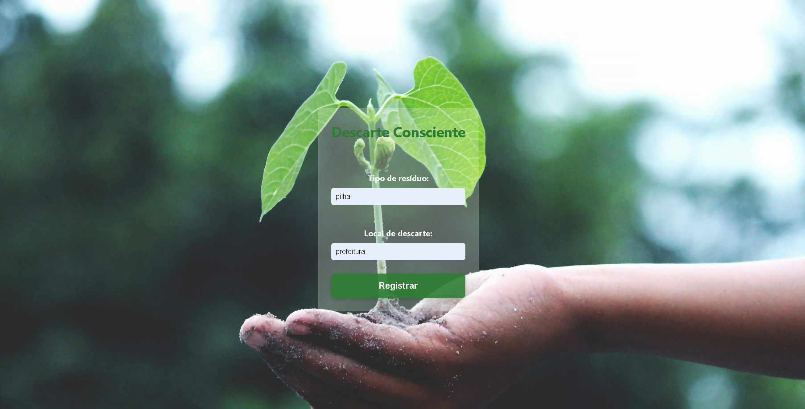

# ♻️ Eco Descarte

Aplicação web desenvolvida para registrar e conscientizar sobre o descarte correto de lixo eletrônico.

## 🛠️ Tecnologias Utilizadas
- React
- Vite
- JavaScript
- CSS
- GitHub Pages

## 📸 Interface do Usuário




## 🧠 Descrição Técnica do Projeto

Este projeto consiste em uma aplicação web desenvolvida com **React** e empacotada com **Vite**, voltada para o registro de dados relacionados ao descarte consciente de resíduos eletrônicos. A aplicação foi estruturada com foco em modularidade, desempenho e facilidade de deploy via GitHub Pages.

### 🔧 Arquitetura e Estrutura

- **Frontend:**
  - Framework: `React 18+`
  - Bundler: `Vite` (versão 7.2.2)
  - Linguagem: `JavaScript (ES6+)`
  - Estilização: `CSS puro`, com foco em responsividade
  - Estrutura de componentes: `App.jsx`, `main.jsx`, `index.css`, `App.css`

- **Configuração de Build:**
  - `vite.config.js` configurado com `base: '/eco_descarte/'` para compatibilidade com GitHub Pages
  - Scripts definidos no `package.json` para automação de build e deploy:
    ```json
    "scripts": {
      "dev": "vite",
      "build": "vite build",
      "predeploy": "npm run build",
      "deploy": "gh-pages -d dist"
    }
    ```

- **Controle de versão:**
  - Gerenciado via `Git` e hospedado no `GitHub`
  - Arquivo `.gitignore` configurado para ignorar `node_modules`, `dist`, arquivos de log e diretórios de IDE

### 🚀 Deploy e Publicação

- **Ferramenta de deploy:** `gh-pages` instalada como dependência de desenvolvimento (`npm install gh-pages --save-dev`)
- **Processo de publicação:**
  - Build gerado com `npm run build`
  - Deploy realizado com `npm run deploy`, publicando o conteúdo da pasta `dist` na branch `gh-pages`
- **Hospedagem:**
  - GitHub Pages ativado via `Settings > Pages`, apontando para a branch `gh-pages` e diretório `/ (root)`
  - Link público: `https://alinimaiak.github.io/eco_descarte/`

### ⚠️ Desafios Técnicos Enfrentados

- Configuração do `vite.config.js` para evitar erro de tela branca no GitHub Pages
- Correção do caminho base para garantir que os assets fossem carregados corretamente
- Adição manual dos scripts de deploy no `package.json`
- Aprendizado sobre o fluxo de publicação com `gh-pages` e estrutura de branches no GitHub

### 📦 Dependências e Ferramentas

- `react`, `react-dom` – construção da interface
- `vite` – empacotamento e servidor de desenvolvimento
- `gh-pages` – publicação automatizada
- `eslint` – análise estática de código (via script `lint`)
- `npm` – gerenciamento de pacotes

### 🖥️ Execução Local

Para rodar o projeto localmente:

```bash
git clone https://github.com/alinimaiak/eco_descarte.git
cd eco_descarte
npm install
npm run dev
